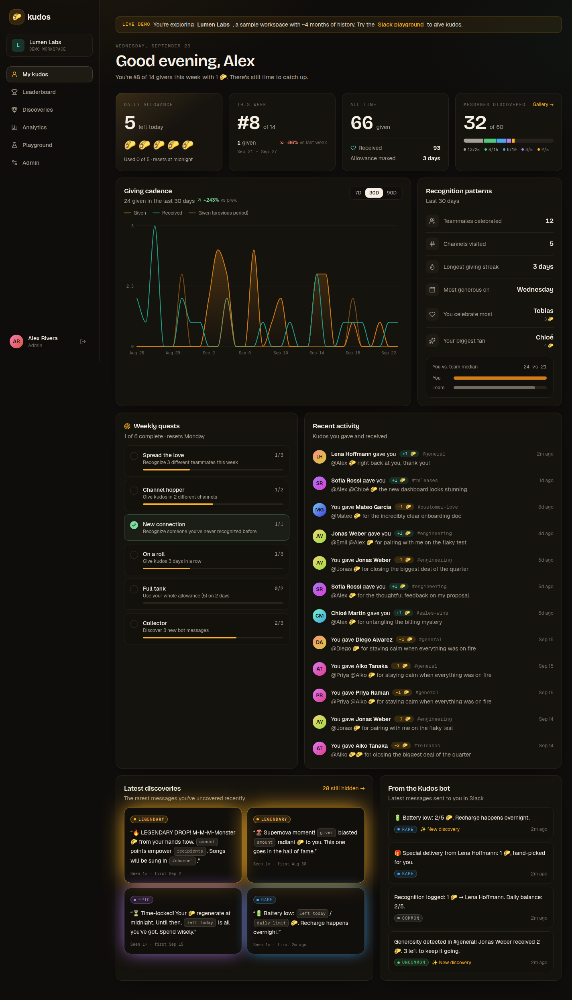
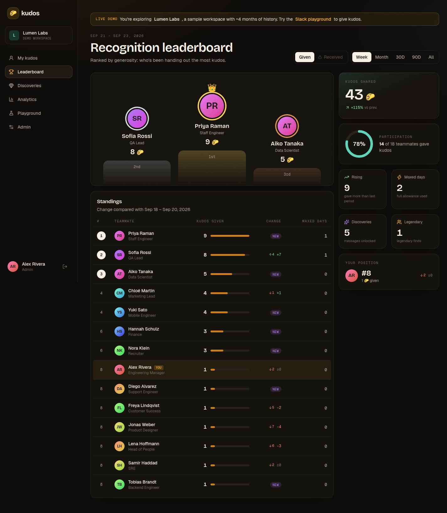
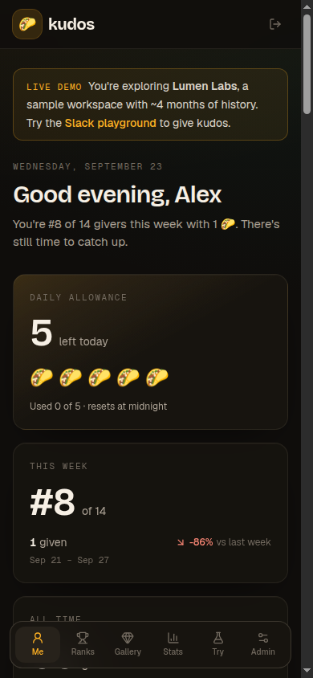

# Kudos

Peer recognition for Slack. Mention teammates with the kudos emoji (`@ana @ben :taco::taco: thanks!`), everyone gets a daily allowance, every bot reply is a collectible message with a rarity, and a web dashboard shows personal stats, leaderboards and team analytics.

Everything runs on one Convex deployment: the database, Slack's Events API webhooks (plain HTTPS, no Socket Mode), Sign in with Slack, and the static React app (`@convex-dev/static-hosting`).

**Live:** https://valiant-monitor-701.convex.site (click "Explore the live demo" for a seeded sample workspace).

| Personal dashboard | Leaderboard |
| --- | --- |
|  |  |



More in [`docs/screenshots/`](docs/screenshots/).

## How it fits together

| Path | What it does |
| --- | --- |
| `convex/http.ts` | Slack webhooks (`/slack/events`, `/slack/commands`, `/slack/interactions`), OAuth install (`/slack/install`), manifest, auth routes, then the SPA catch-all |
| `convex/slack.ts` | Event processing and every Slack Web API call (DMs, ephemeral replies, App Home, member sync) |
| `convex/engine.ts` | The one place kudos are given or revoked: allowance, rollups, totals, maxed days, rarity-rolled bot messages |
| `convex/lib/messages.ts` | The 60 discoverable messages and the rarity roll |
| `convex/me.ts`, `leaderboard.ts`, `analytics.ts`, `discoveries.ts` | Read models for the dashboard |
| `convex/admin.ts` | Settings, admins, moderation (revoke) |
| `convex/demo.ts` | Seeded demo workspace and the Slack playground |
| `src/` | React app (Vite, Tailwind v4, Motion) |

Received kudos are private by default (`receivedVisibility`: `hidden` / `self` / `everyone`, set by admins).

## Install into a Slack workspace

Open `/setup` on the deployment. It shows the manifest with this deployment's URLs, a "create app from manifest" link, which env vars are configured, and the install link. In short:

1. Create the Slack app from `https://<deployment>.convex.site/slack/manifest.json`.
2. `npx convex env set --prod SLACK_CLIENT_ID=… SLACK_CLIENT_SECRET=… SLACK_SIGNING_SECRET=…`
3. Install via `https://<deployment>.convex.site/slack/install`, then `/invite @Kudos` to channels.

Other env vars: `JWT_PRIVATE_KEY` / `JWKS` (Convex Auth), `SITE_URL`, `DEMO_MODE=true` to enable the public demo.

## Develop

```bash
npm install
npx convex dev          # backend, watches convex/
npm run dev             # Vite on :5173
npm test                # vitest + convex-test (unit, engine, HTTP/Slack, authorization)
npm run check           # the merge gate: typecheck + tests + build
```

Deploy: `npx convex deploy && npx @convex-dev/static-hosting upload --build --prod`.
